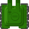
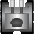
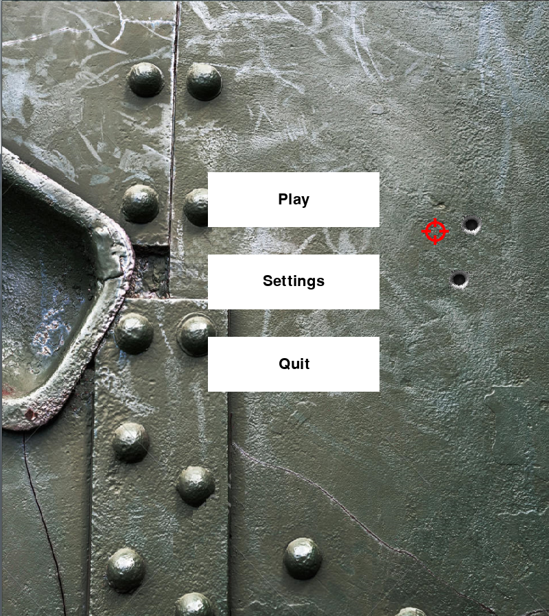
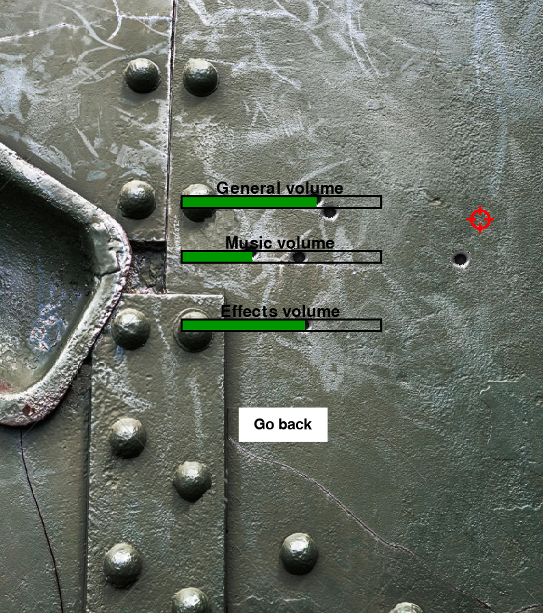
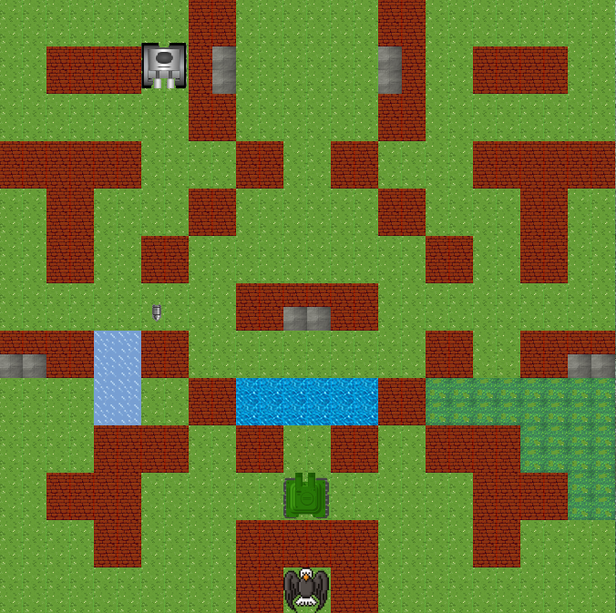
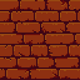
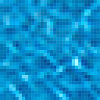
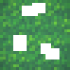

# BattleCity
> Танковая аркада, в которой игрок противостоит 
> танкам противника, управляя зелёным танчиком,
> для защиты базы-орла.

### Суть игры
> __Игровые объекты:__ Игра состоит из нескольких уровней (на данный момент 4),
> которые представляют собой поле тайлов 26 на 26, на поле присутствуют:
> противники(серые танки), игрок(зелёный танк), орёл(просто орёл),
> внизу присутствует панель игровых параметров(количество игровых сердечек - 
> нужны для респавна игрока, если его подбили; количество игровых очков, 
> количество оставшихся танков противника), также в игре присутствуют бонусы,
> которые выпадают при наборе игроком очков(очки приобретаются за уничтожение
> противника)

### Запуск
> **Игра** запускается по пути BattleCity\main.

> Далее открывается окно приложения с главным меню;
> в меню 3 кнопки:  
>"Play" - для запуска игровой части приложения  
> "Settings" - для выхода настройки звукового сопровождения  
> "Quit" - для выхода из приложения  

> __Цель игры__: отражать атаки противников, появляющихся 
> в определённых частях карты (а также сохранять целым свой танчик,
> защищать орла, уничтожать все танки противника)

### Игровой процесс
> На каждом уровне игроку необходимо уничтожить комплект противников(состоит из разных
> типов танков: легкий, тяжёлый, быстрый, с быстрой стрельбой) используя механики игры:
> разрушаемые и неразрушаемые стены, водные препятствия, лёд и деревья
> 
> Если комплект противника уничтожен, игроку предлагается перейти на следующий уровень,
> если же игроку не посчастливилось потерять орла или танчик, предлагается перезапуск
> игровой сессии.
> 
> По прохождении всех уровней игра возвращается на главный экран.
>
> Управление:  
> WASD - передвижение по игровому полю  
> Space - стрелять

### Приложение 

> Это танк игрока:  Скорость: 5;
> Здоровье: 1 

> Это орёл: 

> Это танки противников:

|                    Параметр                    |                 Лёгкий танк                  |                 Быстрый танк                 |              Скорострельный танк               |                 Тяжёлый танк                 |
|:----------------------------------------------:|:--------------------------------------------:|:--------------------------------------------:|:----------------------------------------------:|:--------------------------------------------:|
|                    Картинка                    |  |  |  |  |
 | Скорость(скорость обновления кадра на пиксель) |                      1                       |                      2                       |                       1                        |                      1                       |
|                    Здоровье                    |                      1                       |                      1                       |                       1                        |                      4                       |
|        Частота выстрелов (на 60 кадров)        |                      30                      |                      30                      |                       45                       |                      30                      |
|                      Очки                      |                     100                      |                     200                      |                      300                       |                     400                      |

> Это бонусы:

|   Тип    |                 Скорость                 |                Здоровье                 |              Пробивная стрельба               |
|:--------:|:----------------------------------------:|:---------------------------------------:|:---------------------------------------------:|
| Картинка |             |      |             |
| Описание | Увеличивает на 30 секунд скорость игрока | Увеличивает запасные жизни игрока на 1. | Даёт два выстрела для пробития бетонных стен. |

> Пример главного экрана:
> 

> Пример настроек:
> 

> Пример игровой карты:
> 

> Это тайлы:

|   Тип    |                  Земля                   |               Кирпичная стена                |             Бетонная стена              |                                Вода                                 |                  Лёд                   |              Листва              |
|:--------:|:----------------------------------------:|:--------------------------------------------:|:---------------------------------------:|:-------------------------------------------------------------------:|:--------------------------------------:|:--------------------------------:|
| Картинка |               |                   |       |                                          |           |  |
| Описание | Позволяет свободно передвигаться по полю | Препятствие, уничтожаемое базовыми снарядами | Препятствие, уничтожаемое спецснарядами | Естественное препятствие - нельзя пройти, можно через него стрелять | Препятсвие - можно пройти, но медленно | Снижает видимость, можно пройти  |